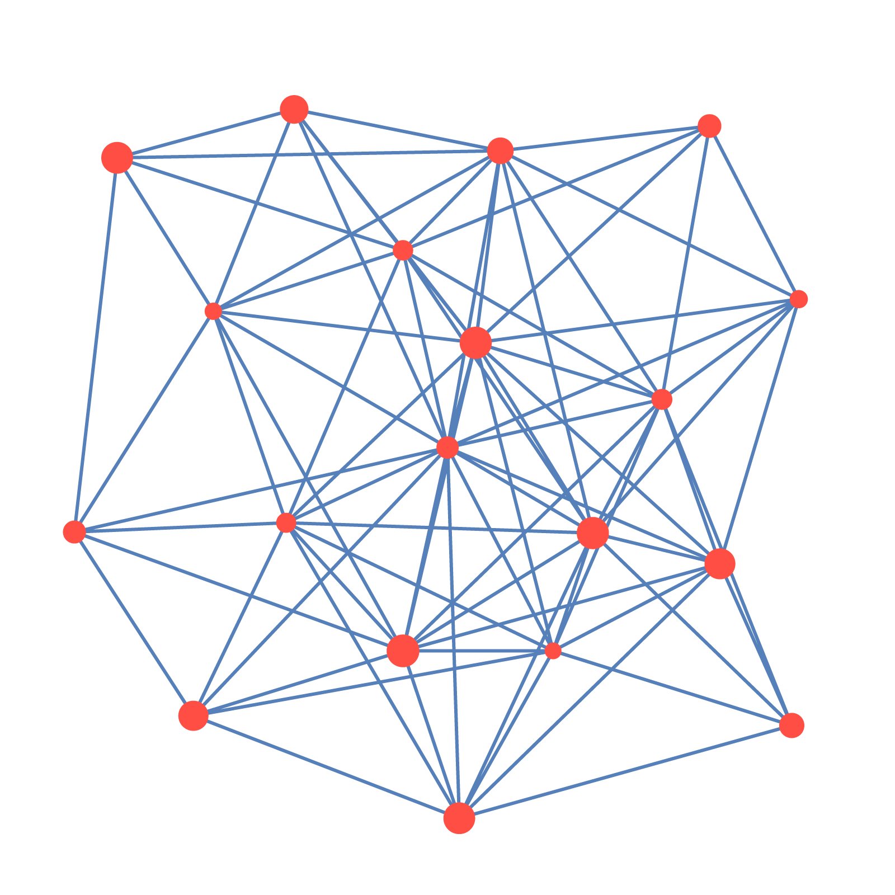

# Рисование линий между центрами выделенных объектов

Скрипт для Иллюстратора, который рисует все возможные линии между выделенными объектами (по их центрам).

Сам скрипт:
<pre>LinesBetweenObjects.jsx</pre>

Как запускать скрипты можно <a href="https://adobescript.ru/tech/script#run">прочитать тут</a>.

Ко всем нарисованным линиям можно сразу применить графический стиль — GraphicStyle — из палитры Иллюстратора.

## Настройки

Настройки скрипта можно изменить, открыв его для редактирования с помощью любого текстового редактора. 
Все доступные изменения находятся в верхней части скрипта.

Имя слоя, в который будут создаваться линии (если слоя нет, он будет создан)
<pre>const LAYER_NAME = 'lineBetweenObjects'</pre>

Имя графического стиля, который будет применяться, если он найден
<pre>const GRAPHIC_STYLE_NAME = 'lineBetweenObjects'</pre>

Можно ограничить число линий константой
<pre>const LIMIT = 500</pre>

Можно выставить максимальное расстояние между объектами (в пунктах)
<pre>const LENGTH_MAXIMUM = 1000</pre>

